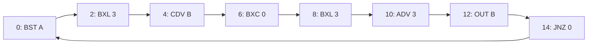

Input program:



In code:

```
 0: b = a % 8
 2: b = b ^ 3
 4: c = a / (2**b) # a >> b
 6: b = b ^ c
 8: b = b ^ 3
10: a = a / (2**3) # a >> 3
12: out << b % 8
14: loop
```

1. Take last 3 bits of a
2. Flip the last 2 bits
3. Xor it with a shifted by that (just 3 bits relevant)
4. Flip the last 2 bits
5. Output the last 3 bits
6. a >> 3, repeat